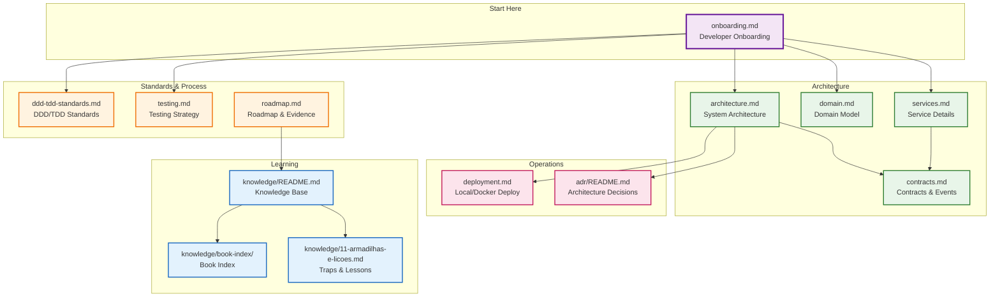

# ACME Car Rental — Documentation Hub
 
> **Source of truth: the code.** These documents are a **living map** of the architecture.
> If code and doc diverge, code wins — update the map.
 
Vehicle rental system built **chapter by chapter** following *Quarkus in Action* (Štefanko & Martiška, Manning, 2025). Small, independent services, each in its own Maven module (microservice mindset, no shared parent; the root `pom.xml` is *only* a test-running reactor).
 
## Quick Navigation by Role
 

 
## Document Catalog
 
### 🏗️ Architecture (How the system works)
 
| Document | Purpose | Audience |
|----------|---------|----------|
| [architecture.md](./architecture.md) | System architecture: layered, hexagonal, reactive, messaging, decisions | All |
| [domain.md](./domain.md) | Bounded contexts, aggregates, value objects, state machines | Domain experts, Devs |
| [services.md](./services.md) | Per-service: ports, endpoints, dependencies, repo, status | Devs, Ops |
| [contracts.md](./contracts.md) | gRPC protobuf, Kafka events, versioning, compatibility | Devs, Integrators |
| [deployment.md](./deployment.md) | Local/Docker: compose, Traefik, Swagger, Keycloak, env | Devs, Ops |
 
### 📏 Standards & Process (How we work)
 
| Document | Purpose | Audience |
|----------|---------|----------|
| [onboarding.md](./onboarding.md) | **Start here** - 30 min setup, mental model, common tasks | **New developers** |
| [ddd-tdd-standards.md](./ddd-tdd-standards.md) | Mandatory architectural language across all modules | All |
| [testing.md](./testing.md) | Test pyramid, TDD flow, naming, reactive testing | Devs |
| [roadmap.md](./roadmap.md) | Chapter-by-chapter progress with executable evidence | Leads, PMs |
 
### 🧠 Learning (Why we did it this way)
 
| Document | Purpose | Audience |
|----------|---------|----------|
| [knowledge/README.md](./knowledge/README.md) | Study base: book concepts, project patterns, divergences | Devs |
| [knowledge/11-armadilhas-e-licoes.md](./knowledge/11-armadilhas-e-licoes.md) | Real traps hit, diagnosis, prevention | Devs |
| [knowledge/10-exemplos-contrarios-ao-dominio.md](./knowledge/10-exemplos-contrarios-ao-dominio.md) | Anti-patterns for comparison | Devs |
| [adr/README.md](./adr/README.md) | Architecture Decision Records (study order) | Devs, Leads |
| [knowledge/book-index/](./knowledge/book-index/) | Where in the book each topic is (page numbers) | Devs |
 
## Status Legend
 
Used on **all** pages per component/feature:
 
| Symbol | Meaning |
|--------|---------|
| ✅ | Implemented + validated |
| ⚠️ | Partial / operational, known issue |
| 🚧 | Placeholder (structure ready, not implemented) |
| 🔜 | Planned (chapter not yet read/implemented) |
 
## Book → Documentation Map
 
Use this table to know **where to record** new learnings. When finishing a chapter, update the indicated pages and mark the item in [roadmap.md](./roadmap.md).
 
| Chapter | Topic | Recorded In | Study Base |
|---------|-------|-------------|------------|
| 1 | What is Quarkus | — (conceptual) | `knowledge/01-fundamentos-e-dev-mode.md` |
| 2 | First application | `services.md` | `knowledge/01-fundamentos-e-dev-mode.md` |
| 3 | Dev productivity | `services.md`, `testing.md` | `knowledge/01-fundamentos-e-dev-mode.md` |
| 4 | Communications (REST/GraphQL/gRPC) | `architecture.md`, `services.md`, `contracts.md` | `knowledge/02-comunicacoes.md` |
| 5 | Testing | `testing.md` | `knowledge/03-testes-quarkus.md`, `knowledge/04-estrategia-de-testes-do-projeto.md` |
| 6 | Web apps + security | `services.md` (users/OIDC), `deployment.md`, `roadmap.md` | `knowledge/05-web-oauth-e-modo-producao.md` |
| 7 | Database access | `services.md` (repos), `contracts.md`, `roadmap.md` | `knowledge/06-persistencia-transacoes-e-nosql.md` |
| 8 | Reactive programming | `architecture.md`, `services.md` | `knowledge/07-programacao-reativa.md` |
| 9 | Quarkus messaging | `services.md` (billing), `contracts.md`, `roadmap.md`, `adr/` | `knowledge/08-messaging-reativo.md`, `knowledge/09-padroes-de-resiliencia-em-messaging.md`, `knowledge/13-transactional-outbox.md` |
| 10 | Cloud-native (health, metrics, tracing, FT, SD) | `roadmap.md`, `services.md`, `architecture.md`, `contracts.md`, `testing.md`, `adr/009-fault-tolerance-chamadas-externas.md` | `knowledge/14-cloud-native-patterns.md`, `knowledge/book-index/cap10.txt` |
| 11 | Cloud, K8s/OpenShift, serverless | `deployment.md`, `roadmap.md` | `knowledge/book-index/cap11.txt` |
| 12 | Custom Quarkus extensions | `roadmap.md` | `knowledge/book-index/cap12.txt` |
 
> ⚠️ **Book version mismatch.** *Quarkus in Action* uses **Quarkus 3.15.1 / MicroProfile 6.1**; this repo is on **3.39.3**. Roadmap tracks **capability + evidence**, not book steps — see [roadmap.md](./roadmap.md) "How to read".
>
> Book text **not in repo** (commercial). Navigable TOC with pages at [knowledge/book-index/](./knowledge/book-index/README.md).
 
## Working with OpenCode
 
Agents and commands in `.opencode/` review DDD, TDD, Quarkus, and architectural consistency. `feature-implementer` is the default agent in `opencode.json`.
 
Before a significant change, use `/preflight <feature>`. After, run `/ddd-audit`, `/tdd-audit`, `/quarkus-audit`, or `/architecture-audit` as appropriate.
 
## Two Documentation Families
 
| Family | Question Answered | Where |
|--------|-------------------|-------|
| **Architecture** | "How is the system today?" | This index, except `knowledge/` |
| **Study** (`knowledge/`) | "Why did I do this, what did I learn?" | [`knowledge/`](./knowledge/README.md) |
 
`knowledge/` stores **reasoning**: book concepts, pattern divergences, real traps, anti-pattern examples. It points to code but **does not replace** architecture pages.
 
## Maintenance Rules
 
1. Every page has `Last updated:` on first line (date + book chapter).
2. Code is truth — when changing code, sync doc in same PR/commit.
3. Every new component gets a status (✅/⚠️/🚧/🔜).
4. New decisions go to `architecture.md` → "Decisions".
5. New chapter read → fill `knowledge/12-modelo-para-novos-capitulos.md` and add line to maps above.
6. Book TOC change → regenerate `knowledge/book-index/` with `tools/book-index/extract.py` and commit only the index.
 
---
 
_Last updated: 2026-10-05 (cap. 10 item 8 alinhado em contracts/testing/adr 009; nav diagram restyled; docs/knowledge for ch.1-9; ch.10-12 scope confirmed against book; book index in knowledge/book-index)_