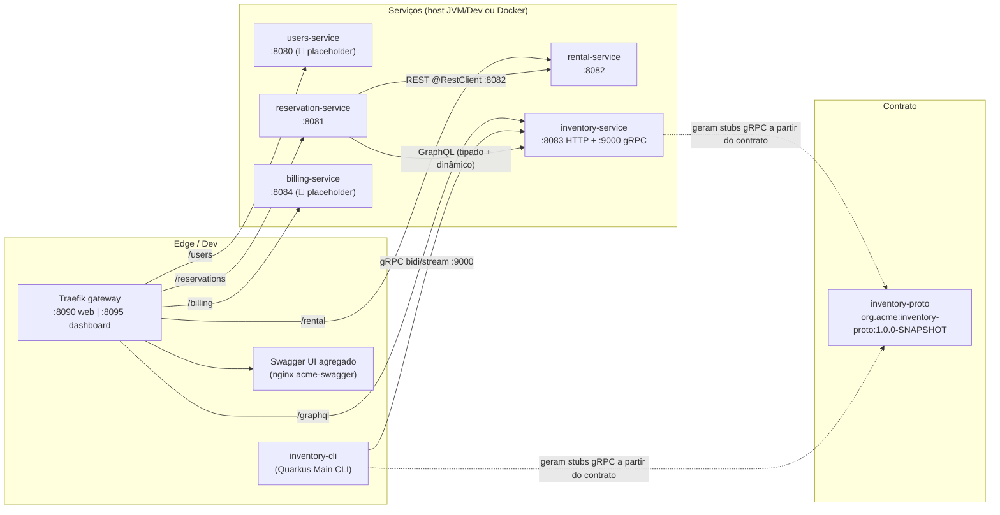
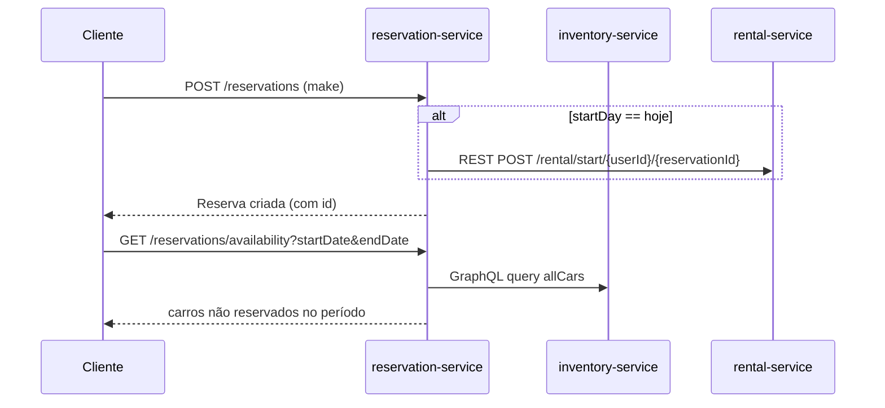

# Arquitetura — Visão Geral

> **Última atualização:** 2026-09-19 (base cap.1-5) · **Fonte da verdade:** o código.

## Resumo

Sistema **acme-car-rental**: um ecossistema de serviços independentes (cada um em seu
módulo Maven, **sem reactor/aggregator**) que se comunicam por REST, GraphQL e gRPC,
atrás de um gateway Traefik com um Swagger UI agregado. Persistência é **in-memory por
default** (port & adapter) — bancos reais entram a partir do cap.7 do livro.

## Diagrama de componentes

> O **inventory-service não expõe REST** — só GraphQL (para humanos e para o
> reservation) e gRPC (para o CLI). Por isso o gateway encurta `/graphql` para ele e o
> CLI o acessa direto na porta gRPC (`:9000`), sem passar pelo gateway.

## Tabela de portas

| Componente | HTTP | gRPC | Teste (JVM) | Docker (profile `docker`) |
|---|---|---|---|---|
| users-service | 8080 | — | — | 8080 |
| reservation-service | 8081 | — | **8181** (HTTP test) | 8081 |
| rental-service | 8082 | — | — | 8082 |
| inventory-service | 8083 | 9000 | — | 8083 |
| billing-service | 8084 | — | — | 8084 |
| Traefik gateway | 8090 | — | — | 8090 |
| Traefik dashboard | 8095 | — | — | 8095 |
| inventory-cli | — | client → localhost:9000 | — | — |
| inventory-proto | — | (contrato, não executa) | — | — |

Portas via env (`.env` / `${VAR}`): `USER_SERVICE_PORT`, `RESERVATION_PORT`,
`RENTAL_PORT`, `INVENTORY_PORT`, `BILLING_PORT`, `GATEWAY_PORT`, `DASHBOARD_PORT`.

## Protocolos por par

| Origem → Destino | Protocolo | Mecanismo |
|---|---|---|
| Navegador → serviços | REST | Traefik (PathPrefix) |
| reservation → rental | REST | `@RestClient` (MicroProfile REST Client) + Jackson |
| reservation → inventory | GraphQL | Tipado (`@GraphQLClient("inventory")`) + Dinâmico (`DynamicGraphQLClient`) |
| CLI → inventory | gRPC | unary `remove` + **bidirecional stream** `add` |
| inventory ← contrato | gRPC | stubs gerados de `inventory-proto` na build |

## Fluxos principais

1. **Reserva** — `POST /reservations` persiste a reserva. Se a locação começa HOJE,
   o reservation dispara o fluxo de aluguel chamando o rental via REST.
2. **Disponibilidade** — `GET /reservations/availability` busca todos os carros no
   inventory (GraphQL) e remove os que têm reserva sobreposta no período.
3. **Inventário avançado** — endpoints `/reservations/inventory*` fazem **projeção de
   campos**, busca, filtro estruturado e ordenação via cliente **dinâmico** GraphQL.

## Padrões adotados

- **Port & Adapter (persistência)** — cada serviço tem `XRepository` (porta) e adapters
  em `repository/memory` (default via `app.repository=memory` + `@IfBuildProperty`) e,
  quando preparado, adapters reais (ex.: `MongoRentalRepository`). Bancos entram no
  cap.7.
- **Schema-first / contrato externo (gRPC)** — `inventory-proto` é um artefato standalone;
  servidor e cliente geram stubs da mesma fonte (evita divergência).
- **Code-first (GraphQL)** — schema gerado das anotações MicroProfile GraphQL.
- **Config por env com default local e override Docker** — `quarkus.http.port=${VAR:default}`
  e perfil `%docker.` apontando para nomes de container.
- **Convenção de nomes/pacotes padronizada** — `org.acme.<serviço>.{api,client,model,repository}`.

## Decisões (ADR-lite)

| # | Decisão | Motivação / Observação |
|---|---|---|
| 1 | Sem módulo pai/aggregator (reactor) | Microservices independentes; cada um compila seu próprio ritmo |
| 2 | Contrato gRPC em artefato separado (`inventory-proto`) | Fonte única (schema-first); compat definida no wire |
| 3 | Persistência in-memory por default (port & adapter) | Cursos rápidos do livro; banco entra no cap.7 |
| 4 | gRPC reflection sempre ligada | Permite `grpcurl`/Dev UI sem proto local |
| 5 | Teste do reservation em porta dedicada (`8181`) | Evita clash com o dev 8081 no continuous testing |
| 6 | Testes de mock só com Mockito (`QuarkusMock`) | Cap.5: `@Mock` CDI (5.3.1) conflita com Mockito (5.3.2) |
| 7 | CLI de inventário como app Quarkus Main | Ferramenta administrativa executável via `java -jar` |

## Estado por serviço (resumo)

| Serviço | Estado | Observação |
|---|---|---|
| inventory-service | ✅ | GraphQL + gRPC completos (cap.4) |
| reservation-service | ✅ | REST + clientes + testes (cap.4-5) |
| rental-service | ⚠️ | REST básico; Mongo preparado, sem banco |
| users-service | 🚧 | Placeholder (deps OIDC para cap.6) |
| billing-service | 🚧 | Placeholder (deps messaging/mongo p/ caps. futuros) |
| inventory-cli | ✅ | gRPC add (stream) / remove |
| inventory-proto | ✅ | Contrato standalone 1.0.0-SNAPSHOT |

---

_Próximo capítulo a integrar: **cap.6 (Exposing e securing web applications)** — veja [roadmap.md](./roadmap.md)._