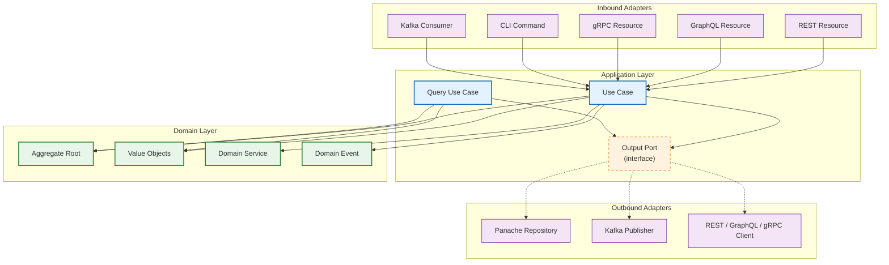
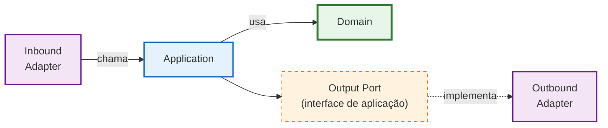
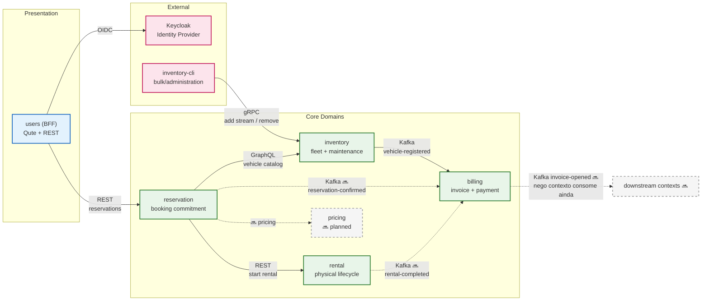
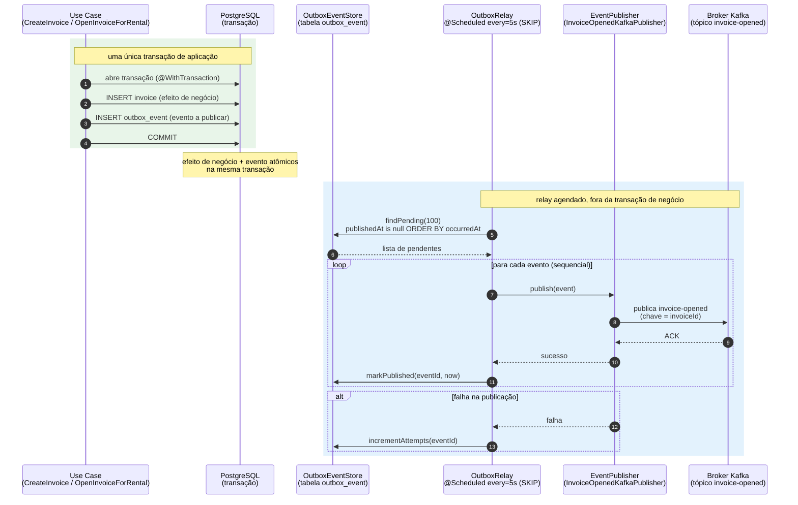
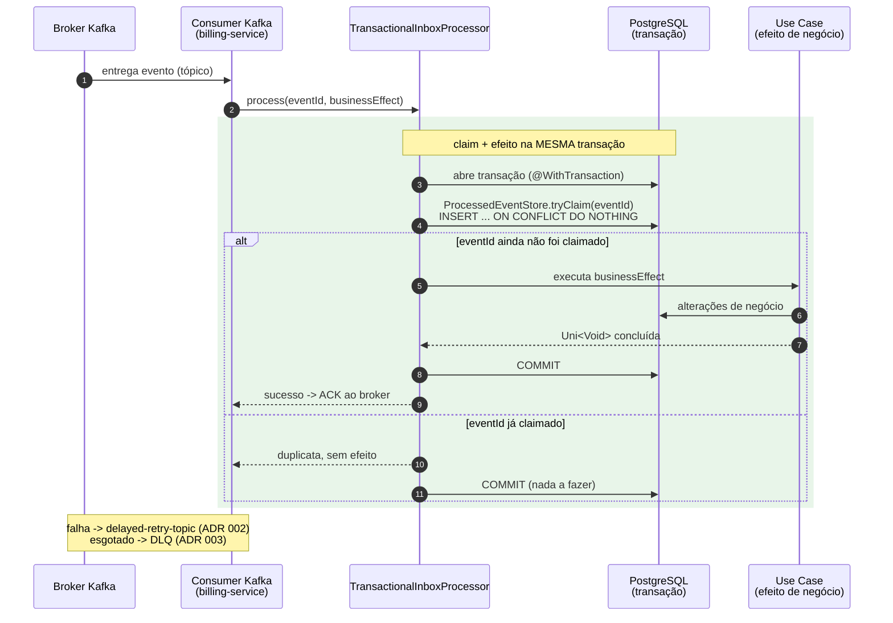
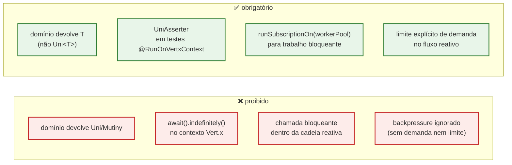
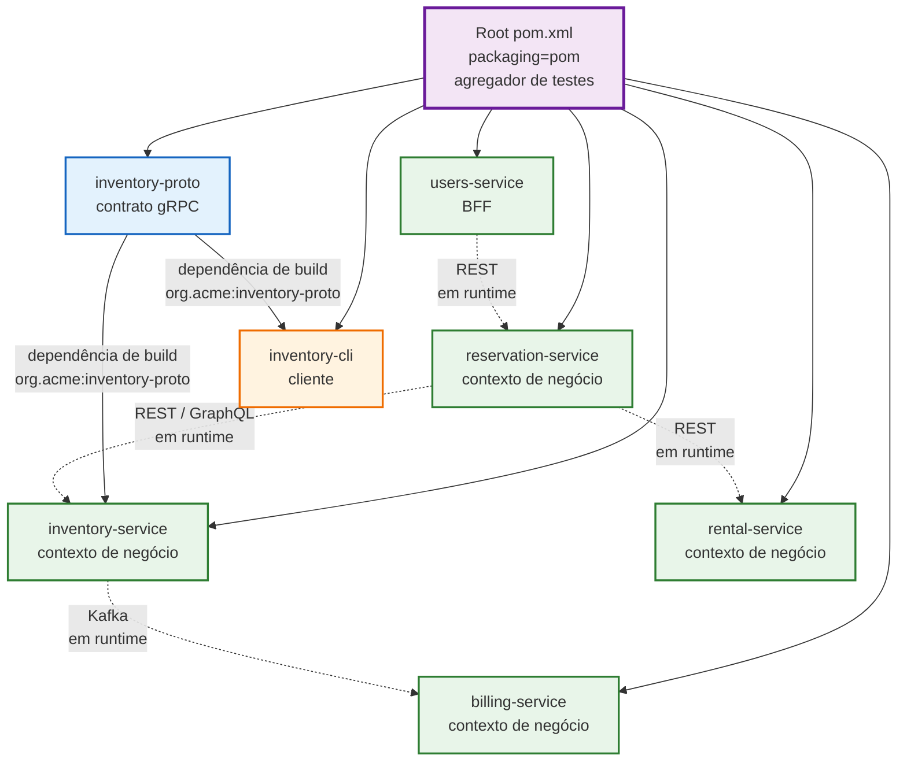
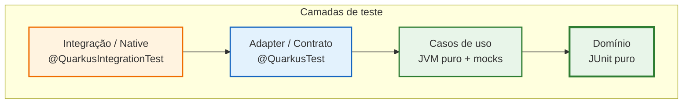
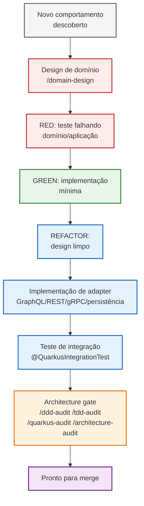

# Arquitetura — ACME Car Rental

> Fonte da verdade: código + docs/ddd-tdd-standards.md + docs/domain.md.
> Java 21 · Quarkus 3.39.3.

## Visão
 
O projeto é um laboratório de engenharia para aplicar progressivamente os conceitos do Quarkus in Action junto com DDD, TDD e arquitetura distribuída.
 
Os serviços de negócio usam o mesmo sentido arquitetural:

```mermaid
flowchart TB
  subgraph IN["Inbound Adapters"]
    REST[REST Resource]
    GraphQL[GraphQL Resource]
    gRPC[gRPC Resource]
    CLI[CLI Command]
    MessagingIn[Kafka Consumer]
  end

  subgraph APP["Application Layer"]
    UseCase[Use Case]
    Query[Query Use Case]
    PortOut["Output Port<br/>(interface)"]
  end

  subgraph DOM["Domain Layer"]
    Aggregate[Aggregate Root]
    VO[Value Objects]
    DomainService[Domain Service]
    DomainEvent[Domain Event]
  end

  subgraph OUT["Outbound Adapters"]
    Persistence[Panache Repository]
    MessagingOut[Kafka Publisher]
    ExternalClient[REST / GraphQL / gRPC Client]
  end

  REST --> UseCase
  GraphQL --> UseCase
  gRPC --> UseCase
  CLI --> UseCase
  MessagingIn --> UseCase

  UseCase --> Aggregate
  UseCase --> VO
  UseCase --> DomainService
  UseCase --> DomainEvent
  Query --> Aggregate
  Query --> VO

  UseCase --> PortOut
  Query --> PortOut

  PortOut -.-> Persistence
  PortOut -.-> MessagingOut
  PortOut -.-> ExternalClient

  classDef domain fill:#e8f5e9,stroke:#2e7d32,stroke-width:2px;
  classDef application fill:#e3f2fd,stroke:#1565c0,stroke-width:2px;
  classDef port fill:#fff3e0,stroke:#ef6c00,stroke-dasharray: 5 5;
  classDef adapter fill:#f3e5f5,stroke:#6a1b9a;

  class Aggregate,VO,DomainService,DomainEvent domain;
  class UseCase,Query application;
  class PortOut port;
  class REST,GraphQL,gRPC,CLI,MessagingIn,Persistence,MessagingOut,ExternalClient adapter;
```

A infraestrutura conhece o domínio. O domínio não conhece a infraestrutura.
 
### Regra de Dependência (Hexagonal)
 

```mermaid
flowchart LR
    In["Inbound<br/>Adapter"] -->|"chama"| App[Application]
    App -->|"usa"| Dom[Domain]
    App --> Port["Output Port<br/>(interface de aplicação)"]
    Port -.->|"implementa"| Out["Outbound<br/>Adapter"]

    classDef domain fill:#e8f5e9,stroke:#2e7d32,stroke-width:3px;
    classDef application fill:#e3f2fd,stroke:#1565c0,stroke-width:2px;
    classDef port fill:#fff3e0,stroke:#ef6c00,stroke-dasharray: 5 5;
    classDef adapter fill:#f3e5f5,stroke:#6a1b9a,stroke-width:2px;

    class Dom domain;
    class App application;
    class Port port;
    class In,Out adapter;
```

Os portos saem da aplicação (a interface vive na application) e os adapters os
implementam — o domínio não conhece nenhum porto nem infraestrutura.

## Bounded contexts
 

```mermaid
flowchart LR
    subgraph EXT["External"]
        Identity[Keycloak<br/>Identity Provider]
        Cli["inventory-cli<br/>bulk/administration"]
    end

    subgraph PRES["Presentation"]
        Users["users (BFF)<br/>Qute + REST"]
    end

    subgraph CORE["Core Domains"]
        Reservation["reservation<br/>booking commitment"]
        Inventory["inventory<br/>fleet + maintenance"]
        Rental["rental<br/>physical lifecycle"]
        Billing["billing<br/>invoice + payment"]
        Pricing["pricing<br/>🔜 planned"]
    end

    Users -->|"REST<br/>reservations"| Reservation
    Users -->|"OIDC"| Identity
    Cli -->|"gRPC<br/>add stream / remove"| Inventory
    Reservation -->|"GraphQL<br/>vehicle catalog"| Inventory
    Reservation -->|"REST<br/>start rental"| Rental
    Inventory -->|"Kafka<br/>vehicle-registered"| Billing
    Reservation -.->|"Kafka 🔜<br/>reservation-confirmed"| Billing
    Rental -.->|"Kafka 🔜<br/>rental-completed"| Billing
    Reservation -.->|"🔜 pricing"| Pricing
    Billing -.->|"Kafka invoice-opened 🔜<br/>nego contexto consome ainda"| Downstream["downstream contexts 🔜"]

    classDef core fill:#e8f5e9,stroke:#2e7d32,stroke-width:2px;
    classDef presentation fill:#e3f2fd,stroke:#1565c0,stroke-width:2px;
    classDef external fill:#fce4ec,stroke:#c2185b,stroke-width:2px;
    classDef future fill:#f5f5f5,stroke:#9e9e9e,stroke-width:2px,stroke-dasharray: 5 5;

    class Reservation,Inventory,Rental,Billing core;
    class Users presentation;
    class Identity,Cli external;
    class Pricing,Downstream future;
```

Sólido = existe no código. Tracejado = 🔜 planejado: os tópicos `reservation-confirmed` e
`rental-completed` são consumidos por `billing-service`, mas **nenhum serviço os publica**
(só o harness de teste); `invoice-opened` é publicado de verdade pela outbox, mas
**nenhum contexto o consome** ainda.

### Inventory / Fleet
Dono da frota, dos veículos e de seu estado operacional.
Aggregates: Vehicle e MaintenanceOrder.
Vehicle também mantém condition e odometer; MaintenanceOrder modela o workflow de manutenção.
O inventário não possui reservas e não decide disponibilidade temporal.

### Reservation
Dono do compromisso de reserva.
Aggregate root: Reservation.
Conhece apenas IDs externos (CustomerId, VehicleId) e contratos de outras fronteiras.

### Rental
Dono do ciclo de vida físico da locação.
Aggregate root: Rental.

### Billing
Dono futuro de faturas e pagamento.
Aggregate root inicial: Invoice.

### Users
BFF/presentation service. Não duplica os aggregates de Reservation ou Inventory.

## Comunicação

| Origem | Destino | Canal | Responsabilidade | Status |
|---|---|---|---|---|
| users | keycloak | OIDC | identidade e propagação de token | ✅ |
| users | reservation | REST (`ReservationsRestGateway`) | interação do navegador | ✅ |
| inventory-cli | inventory | gRPC | administração e bulk (`add` stream, `remove`) | ✅ |
| reservation | inventory | GraphQL (`allCars`) | consulta de catálogo/disponibilidade | ✅ |
| reservation | rental | REST (`RentalRestGateway`) | iniciar locação imediata | ✅ |
| inventory | billing | Kafka `vehicle-registered` | evento de cadastro do veículo | ✅ |
| billing | — | Kafka `invoice-opened` | evento de fatura aberta (outbox transacional) | ⚠️ nenhum consumidor |
| reservation | billing | Kafka `reservation-confirmed` | evento de reserva confirmada | 🔜 sem produtor |
| rental | billing | Kafka `rental-completed` | evento de locação concluída | 🔜 sem produtor |
| reservation | pricing | gRPC/REST | cotação | 🔜 |

Contratos externos nunca atravessam a aplicação como modelos de domínio: cada contexto mantém
sua própria representação anti-corrupção (ver [contracts.md](./contracts.md)).

## Inventory — estrutura

~~~text
inventory-service/src/main/java/org/acme/inventory/
├── domain/model/
│   ├── Vehicle.java
│   ├── VehicleId.java
│   ├── LicensePlate.java
│   ├── VehicleSpecifications.java
│   ├── VehicleLocation.java
│   ├── VehicleStatus.java
│   ├── VehicleCondition.java
│   ├── VehicleDailyRate.java
│   ├── OdometerReading.java
│   ├── MaintenanceOrder.java
│   ├── MaintenanceOrderId.java
│   ├── MaintenanceType.java
│   ├── MaintenanceStatus.java
│   ├── VehicleCategory.java
│   ├── Transmission.java
│   └── FuelType.java
├── domain/event/
│   └── VehicleRegistered.java
├── application/
│   ├── usecase/
│   ├── query/            (VehicleFilter, VehicleSearch, VehiclePage...)
│   └── port/out/
└── adapter/
    ├── in/graphql/
    ├── in/grpc/
    ├── in/rest/
    └── out/
        ├── messaging/
        │   ├── VehicleRegisteredEventPublisher.java (vehicle-registered, key=vehicleId)
        │   └── EventJsonCodec.java                  (codec JSON dos eventos)
        ├── observability/MicrometerInventoryMetrics.java
        └── persistence/
~~~

## Reservation — estrutura

~~~text
reservation-service/src/main/java/org/acme/reservation/
├── domain/model/
│   ├── Reservation.java
│   ├── ReservationStatus.java
│   ├── RentalPeriod.java
│   ├── CustomerId.java
│   ├── VehicleId.java
│   └── ReservationId.java
├── application/
│   ├── usecase/
│   ├── query/
│   ├── exception/                    (falha de aplicação, ex.: InventoryUnavailable — decisão 17)
│   └── port/out/
└── adapter/
    ├── in/rest/
    │   └── model/                     (DTOs de transporte)
    ├── in/security/
    └── out/
        ├── inventory/                 (GraphQLInventoryGateway)
        ├── rental/                    (RentalRestGateway)
        ├── registration/              (ConsulServiceRegistration — cap.10 item 9)
        └── persistence/
~~~

## Rental — estrutura

~~~text
rental-service/src/main/java/org/acme/rental/
├── domain/model/
├── application/
│   ├── usecase/
│   └── port/out/
└── adapter/
    ├── in/rest/
    └── out/
        ├── persistence/
        └── registration/              (ConsulServiceRegistration — cap.10 item 9)
~~~

## Billing — estrutura inicial

~~~text
billing-service/src/main/java/org/acme/billing/
├── domain/model/
│   ├── Invoice.java
│   ├── InvoiceId.java
│   ├── InvoiceLine.java
│   ├── Money.java
│   ├── InvoiceStatus.java
│   ├── PaymentMethod.java
│   └── PaymentStatus.java
├── application/
│   ├── usecase/
│   │   ├── CreateInvoice.java            (ReservationConfirmed -> invoice DRAFT)
│   │   ├── OpenInvoiceForRental.java     (RentalCompleted -> linha efetiva + OPEN)
│   │   ├── ConsumeReservationConfirmed.java
│   │   ├── ConsumeRentalCompleted.java
│   │   ├── ConsumeVehicleRegistered.java
│   │   └── PublishPendingOutboxEvents.java   (lote de 100, publicação sequencial)
│   ├── event/
│   │   ├── ReservationConfirmed.java     (contrato anti-corrupção)
│   │   ├── RentalCompleted.java          (contrato anti-corrupção)
│   │   ├── VehicleRegistered.java        (contrato anti-corrupção)
│   │   └── InvoiceOpened.java            (evento publicado, ADR 008)
│   ├── model/OutboxEvent.java
│   └── port/out/
│       ├── InvoiceRepository.java
│       ├── ProcessedEventStore.java
│       ├── OutboxEventStore.java
│       ├── EventPublisher.java
│       └── OutboxMetrics.java                (métricas do relay da outbox)
└── adapter/
    ├── in/messaging/
    │   ├── KafkaReservationConfirmedConsumer.java
    │   ├── KafkaRentalCompletedConsumer.java
    │   ├── KafkaVehicleRegisteredConsumer.java
    │   ├── EventJsonCodec.java                  (codec JSON dos eventos)
    │   ├── InboundEventProcessor.java
    │   └── TransactionalInboxProcessor.java
    └── out/
        ├── messaging/
        │   ├── OutboxRelay.java                (@Scheduled every=5s, SKIP)
        │   └── InvoiceOpenedKafkaPublisher.java (canal invoice-opened-out)
        ├── observability/
        │   └── MicrometerOutboxMetrics.java    (counters + gauge de backlog)
        └── persistence/
            ├── PanacheInvoiceRepository.java
            ├── InvoiceEntity.java / InvoiceMapper.java / InvoiceLinesConverter.java
            ├── PanacheOutboxEventStore.java / OutboxEventEntity.java
            ├── PostgresProcessedEventStore.java (inbox durável, ADR 005)
            └── ProcessedEventEntity.java
~~~

O fluxo de cobrança (cap.9) consome `reservation-confirmed`/`rental-completed` e persiste invoices em
PostgreSQL (DRAFT→OPEN), aplicando idempotência via `TransactionalInboxProcessor` (ADR 007) e inbox durável via `PostgresProcessedEventStore`
(ADR 005); retry via `delayed-retry-topic`
(ADR 002) e DLQ (ADR 003). Na outra direção, `InvoiceOpened` é gravado na outbox
transacional (ADR 008) e publicado por `OutboxRelay`.
O billing expõe `/q/metrics` (registry Prometheus, cap.10): métricas do relay da outbox
(`MicrometerOutboxMetrics`), client metrics do Kafka (lag) e métricas por canal
(`quarkus.messaging.message.*` via `smallrye.messaging.observation.enabled=true`).
 
### Transactional Outbox Pattern (Billing)
 

```mermaid
sequenceDiagram
    autonumber
    participant UC as Use Case<br/>(CreateInvoice / OpenInvoiceForRental)
    participant DB as PostgreSQL<br/>(transação)
    participant Store as OutboxEventStore<br/>(tabela outbox_event)
    participant Relay as OutboxRelay<br/>@Scheduled every=5s (SKIP)
    participant Pub as EventPublisher<br/>(InvoiceOpenedKafkaPublisher)
    participant Kafka as Broker Kafka<br/>(tópico invoice-opened)

    rect rgb(232, 245, 233)
        Note over UC,DB: uma única transação de aplicação
        UC->>DB: abre transação (@WithTransaction)
        UC->>DB: INSERT invoice (efeito de negócio)
        UC->>DB: INSERT outbox_event (evento a publicar)
        UC->>DB: COMMIT
    end
    Note over DB: efeito de negócio + evento atômicos<br/>na mesma transação

    rect rgb(227, 242, 253)
        Note over Relay,Kafka: relay agendado, fora da transação de negócio
        Relay->>Store: findPending(100)<br/>publishedAt is null ORDER BY occurredAt
        Store-->>Relay: lista de pendentes
        loop para cada evento (sequencial)
            Relay->>Pub: publish(event)
            Pub->>Kafka: publica invoice-opened<br/>(chave = invoiceId)
            Kafka-->>Pub: ACK
            Pub-->>Relay: sucesso
            Relay->>Store: markPublished(eventId, now)
        end
        alt falha na publicação
            Pub-->>Relay: falha
            Relay->>Store: incrementAttempts(eventId)
        end
    end
```

A publicação é **at-least-once**: o consumidor deve ser idempotente por `eventId`.
Enquanto nenhum contexto consumir `invoice-opened`, o relay é o único produtor
verificado (`OutboxRelayKafkaIntegrationTest`, `BillingOutboxIntegrationTest`).
 
### Transactional Inbox Pattern (Billing Consumer)
 

```mermaid
sequenceDiagram
    autonumber
    participant Kafka as Broker Kafka
    participant C as Consumer Kafka<br/>(billing-service)
    participant P as TransactionalInboxProcessor
    participant DB as PostgreSQL<br/>(transação)
    participant UC as Use Case<br/>(efeito de negócio)

    Kafka->>C: entrega evento (tópico)
    C->>P: process(eventId, businessEffect)
    rect rgb(232, 245, 233)
        Note over P,DB: claim + efeito na MESMA transação
        P->>DB: abre transação (@WithTransaction)
        P->>DB: ProcessedEventStore.tryClaim(eventId)<br/>INSERT ... ON CONFLICT DO NOTHING
        alt eventId ainda não foi claimado
            P->>UC: executa businessEffect
            UC->>DB: alterações de negócio
            UC-->>P: Uni<Void> concluída
            P->>DB: COMMIT
            P-->>C: sucesso -> ACK ao broker
        else eventId já claimado
            P-->>C: duplicata, sem efeito
            P->>DB: COMMIT (nada a fazer)
        end
    end
    Note over Kafka,C: falha -> delayed-retry-topic (ADR 002)<br/>esgotado -> DLQ (ADR 003)
```

🔴 **Produtor ausente:** `reservation-service` e `rental-service` **não publicam**
`reservation-confirmed` nem `rental-completed` — não há `mp.messaging.*` nem bean emissor
nesses serviços. Hoje o único produtor desses dois tópicos é o harness de teste
(`BillingFlowKafkaIntegrationTest`). O diagrama acima descreve a **intenção**; o lado
produtor está 🔜. `inventory-service` produz `vehicle-registered` de verdade, e
`billing-service` produz `invoice-opened` pela outbox transacional
(`OutboxRelay` → `InvoiceOpenedKafkaPublisher` → tópico `invoice-opened`).

## Users BFF

~~~text
users-service/src/main/java/org/acme/users/
├── application/
│   ├── usecase/
│   ├── model/           (AvailableCar, ReservationView)
│   └── port/out/
└── adapter/
    ├── in/security/
    ├── in/web/
    └── out/reservation/ (ReservationsRestGateway)
~~~

O BFF adapta o modelo remoto de Reservation para a UI. Ele não importa a classe Reservation do reservation-service.

## CLI

~~~text
inventory-cli/src/main/java/org/acme/inventory/cli/
├── application/
└── adapter/
    ├── in/cli/
    └── out/grpc/
~~~

## Persistência
 
Cada bounded context possui seu próprio modelo de persistência. A entidade de
persistência (`*Entity`) e o mapper vivem em `adapter/out/persistence/`; o agregado
de `domain/model/` nunca é anotado com Panache/JPA.
 
A documentação mantém a distinção entre domínio, application, adapter e persistence entity.

## Reactive
 
`inventory-service` (MySQL), `reservation-service` e `billing-service` (PostgreSQL) já usam
Hibernate Reactive + Mutiny (`Panache*Repository` com `@WithSession`/`@WithTransaction` sobre
clientes reativos: `quarkus-reactive-mysql-client` e `quarkus-reactive-pg-client`).
`rental-service` usa Mongo Panache **bloqueante** — persiste fora da regra reativa.
A regra arquitetural é:
 
- domínio não usa Uni/Mutiny (nem `jakarta.*`/`io.quarkus.*`, Panache/JPA/Mongo, exceções HTTP
  ou DTOs de transporte — ver `ddd-tdd-standards.md` §3.4; o tempo entra pela aplicação, não via
  `now()` no domínio);
- aplicação pode compor I/O reativo;
- adapters usam clientes reativos;
- operações bloqueantes são isoladas;
- backpressure é tratado como capacidade do fluxo, não como sinônimo de thread pool.
 
### Prohibited Patterns

```mermaid
flowchart LR
  subgraph WRONG["❌ proibido"]
    W1["domínio devolve Uni/Mutiny"]
    W2["await().indefinitely()<br/>no contexto Vert.x"]
    W3["chamada bloqueante<br/>dentro da cadeia reativa"]
    W4["backpressure ignorado<br/>(sem demanda nem limite)"]
  end

  subgraph RIGHT["✅ obrigatório"]
    C1["domínio devolve T<br/>(não Uni&lt;T&gt;)"]
    C2["UniAsserter<br/>em testes @RunOnVertxContext"]
    C3["runSubscriptionOn(workerPool)<br/>para trabalho bloqueante"]
    C4["limite explícito de demanda<br/>no fluxo reativo"]
  end

  classDef wrong fill:#fdecea,stroke:#c62828,stroke-width:2px;
  classDef right fill:#e8f5e9,stroke:#2e7d32,stroke-width:2px;

  class W1,W2,W3,W4 wrong;
  class C1,C2,C3,C4 right;
```

Quarkus documenta Hibernate Reactive como API voltada a acesso não bloqueante; `@WithTransaction` é a anotação usada para fronteiras transacionais reativas em métodos CDI que retornam `Uni`. Ver <https://quarkus.io/guides/hibernate-reactive> e <https://quarkus.io/guides/hibernate-reactive-panache>.

## Decisões

| # | Decisão | Motivo |
|---|---|---|
| 1 | Serviços sem parent Maven compartilhado | independência dos serviços (o agregador raiz é só para testes) |
| 2 | DDD por bounded context | preservar ownership |
| 3 | Domain/Application/Ports/Adapters | direção clara de dependências |
| 4 | DTOs nas bordas | impedir vazamento de contratos |
| 5 | Panache somente em adapters | manter domínio puro |
| 6 | TDD por comportamento | design guiado por feedback |
| 7 | REST/GraphQL/gRPC como adapters | transporte não é domínio |
| 8 | Users como BFF | não criar falso bounded context |
| 9 | Pricing fora do Inventory | evitar acoplamento semântico |
| 10 | Billing começa com Invoice/Money | preparar domínio sem inventar workflow |
| 11 | Inventory separa Vehicle de MaintenanceOrder | lifecycle da frota e workflow de manutenção têm limites distintos |
| 12 | Consultas de seleção ficam na Application | adapters traduzem protocolo, não acumulam regra de consulta |
| 13 | OpenCode funciona como architecture gate | impedir divergência entre futuras implementações |
| 14 | Agregador raiz **somente para testes** (`packaging=pom`, sem parent/dependencyManagement) | rodar todos os testes com `./mvnw test` sem acoplar os microserviços |
| 15 | Métrica de negócio/pipeline por **porta da aplicação** → adapter Micrometer em `adapter/out/observability` | regra 9 do AGENTS.md (efeito observável ≠ regra de negócio) e precedente do inventory; a intenção fica na aplicação, o instrumento no adapter. **Exceção registrada (billing):** o gauge de backlog faz o adapter chamar `OutboxEventStore.countPending()` na direção oposta — billing-specific, documentada em `ddd-tdd-standards.md` §5-Observability |
| 16 | Tracing ponta a ponta = **efeito de plataforma, sem porta**: `quarkus-opentelemetry` nos serviços com Kafka (billing/inventory) e propagação automática de contexto no header `traceparent` (guia Messaging, seção OpenTelemetry Tracing) | o discriminador entre decisão 15 e 16 é **quem inventa o sinal**: o caso de uso inventa a métrica de negócio (→ porta); o runtime já mede health/tracing (→ sem porta, mesma lógica do health do cap. 10 item 1). Criar porta seria desacoplar de nada. O contexto viaja no header, nunca no payload; o contrato do evento não muda. **Escopo atual:** o salto Kafka inventory→billing; os hops REST/GraphQL (users→reservation, reservation→inventory/rental) não são tracejados porque esses serviços não têm o extension. Evidência: `VehicleRegisteredTracePropagationIntegrationTest` + `BillingTracePropagationIntegrationTest` |
| 17 | `application/exception` é o pacote de **falha de aplicação** (não de domínio) | regras de negócio que valem para qualquer adapter (`InventoryUnavailable`: "não deu para saber" não é `[]`) não pertencem nem ao domínio nem à infraestrutura. É mais preciso que `application/error` genérico: a palavra "exception" já diz que é sinal de falha, e o prefixo `application` diz de quem é a decisão. Nenhum tipo de domínio mora aqui; exceções do domínio continuam no seu agregado (`domain/**`) |
| 18 | A **mesma imagem** por serviço para todo ambiente (cap.10 item 10): Maven profile `docker` publica `acme/<artifactId>:<version>` (`quarkus-container-image-docker`), o compose **consome** (`image:` + `pull_policy: never`), e o comportamento difere só por `QUARKUS_PROFILE` no launch (`%docker` Consul / `%kubernetes` Stork-k8s / `%prod` host) | runtime ≠ build: o catálogo de discovery e o registro são questão do ambiente (ADR 010/011), não do artefato. Nome da imagem ≠ nome de catálogo (`container-image.name=${artifactId}`; `application.name` continua `reservations`/`rentals`). Testes de discovery já selecionam o backend por tag (`consul`/`kubernetes`) e os manifests K8s são versionados em `others/k8s/` |

## Construção e testes
 
Cada serviço é um microserviço independente: build, versionamento de dependências e deploy isolados,
sem parent compartilhado. O `pom.xml` da raiz é um **agregador de conveniência** (packaging `pom`,
apenas `<modules>`): ele conhece os módulos, mas nenhum módulo o conhece — nenhuma herança, nenhum
`dependencyManagement`, nenhuma configuração de plugin é imposta aos serviços.
 
### Maven Reactor Structure
 

```mermaid
flowchart TB
    Root["Root pom.xml<br/>packaging=pom<br/>agregador de testes"]

    Root --> Proto["inventory-proto<br/>contrato gRPC"]
    Root --> Inv["inventory-service<br/>contexto de negócio"]
    Root --> Res["reservation-service<br/>contexto de negócio"]
    Root --> Ren["rental-service<br/>contexto de negócio"]
    Root --> Bill["billing-service<br/>contexto de negócio"]
    Root --> Users["users-service<br/>BFF"]
    Root --> CLI["inventory-cli<br/>cliente"]

    Proto -->|"dependência de build<br/>org.acme:inventory-proto"| Inv
    Proto -->|"dependência de build<br/>org.acme:inventory-proto"| CLI

    Res -.->|"REST / GraphQL<br/>em runtime"| Inv
    Res -.->|"REST<br/>em runtime"| Ren
    Users -.->|"REST<br/>em runtime"| Res
    Inv -.->|"Kafka<br/>em runtime"| Bill

    classDef aggregator fill:#f3e5f5,stroke:#6a1b9a,stroke-width:3px;
    classDef contract fill:#e3f2fd,stroke:#1565c0,stroke-width:2px;
    classDef service fill:#e8f5e9,stroke:#2e7d32,stroke-width:2px;
    classDef client fill:#fff3e0,stroke:#ef6c00,stroke-width:2px;

    class Root aggregator;
    class Proto contract;
    class Inv,Res,Ren,Bill,Users service;
    class CLI client;
```

**Sólido = dependência de build (GAV). Tracejado = comunicação em runtime** (REST, GraphQL,
gRPC, Kafka) — que **não** cria dependência de compilação entre serviços: nenhum serviço
declara dependência Maven sobre outro serviço. As únicas dependências entre artefatos do
repositório são `inventory-proto` → `inventory-service` e `inventory-proto` → `inventory-cli`.
 
### Test Pyramid & Commands
 

```mermaid
flowchart TB
    subgraph L["Camadas de teste"]
        IT["Integração / Native<br/>@QuarkusIntegrationTest"]
        AT["Adapter / Contrato<br/>@QuarkusTest"]
        APPT["Casos de uso<br/>JVM puro + mocks"]
        DOMT["Domínio<br/>JUnit puro"]
    end
 
    IT --> AT
    AT --> APPT
    APPT --> DOMT
 
    classDef l4 fill:#e8f5e9,stroke:#2e7d32,stroke-width:3px;
    classDef l3 fill:#e8f5e9,stroke:#2e7d32,stroke-width:2px;
    classDef l2 fill:#e3f2fd,stroke:#1565c0,stroke-width:2px;
    classDef l1 fill:#fff3e0,stroke:#ef6c00,stroke-width:2px;
 
    class DOMT l4;
    class APPT l3;
    class AT l2;
    class IT l1;
```
 
| Command | Scope | Speed |
|---------|-------|-------|
| `./mvnw test` | All modules (reactor) | ~2-3 min |
| `./mvnw -pl inventory-service test` | Single module | ~30s |
| `./mvnw -pl reservation-service -am test` | Module + deps | ~1 min |
| `./mvnw verify -Pnative` | Native integration | ~10+ min |
 
- `./mvnw test` na raiz executa os testes de todos os módulos em ordem de reactor.
- Subconjunto: `./mvnw -pl reservation-service -am test`.
- O reactor resolve `org.acme:inventory-proto` diretamente do módulo `inventory-proto` (validado
  inclusive para o codegen `scan-for-proto` do Quarkus), dispensando a instalação manual no `~/.m2`
  quando o build parte do agregador.
 
Os módulos continuam sendo implantáveis e testáveis isoladamente (`./mvnw test` dentro de cada modulo).
 
### Portas em teste
 
`@QuarkusTest` usa porta de teste aleatória por padrão e o REST-assured acompanha a mesma porta,
por isso os testes não fixam URLs com porta. O agregador força essa regra com
`.mvn/maven.config` (`-Dquarkus.http.test-port=0`) em qualquer `./mvnw` na raiz. Módulos não devem
definir `quarkus.http.test-port` fixo — evita colisões quando há execuções simultâneas ou builds
paralelos (`-T`).

## Estratégia de evolução
 

```mermaid
flowchart TD
    Behavior["Novo comportamento<br/>descoberto"] --> Design["Design de domínio<br/>/domain-design"]
    Design --> RED["RED: teste falhando<br/>domínio/aplicação"]
    RED --> GREEN["GREEN: implementação<br/>mínima"]
    GREEN --> REFACTOR["REFACTOR:<br/>design limpo"]
    REFACTOR --> Adapter["Implementação de adapter<br/>GraphQL/REST/gRPC/persistência"]
    Adapter --> IT["Teste de integração<br/>@QuarkusIntegrationTest"]
    IT --> Guardians["Architecture gate<br/>/ddd-audit /tdd-audit<br/>/quarkus-audit /architecture-audit"]
    Guardians --> Done["Pronto para merge"]
 
    classDef neutral fill:#f5f5f5,stroke:#616161,stroke-width:2px;
    classDef red fill:#fdecea,stroke:#c62828,stroke-width:2px;
    classDef green fill:#e8f5e9,stroke:#2e7d32,stroke-width:2px;
    classDef blue fill:#e3f2fd,stroke:#1565c0,stroke-width:2px;
    classDef orange fill:#fff3e0,stroke:#ef6c00,stroke-width:2px;
    classDef purple fill:#f3e5f5,stroke:#6a1b9a,stroke-width:2px;
 
    class Behavior neutral;
    class Design,RED red;
    class GREEN green;
    class REFACTOR,Adapter,IT blue;
    class Guardians orange;
    class Done purple;
```
 
A aplicação só ganha complexidade quando um comportamento exigir essa complexidade.
---
_Last updated: 2026-10-05 (decisão 17 — `application/exception` para sinal de falha da aplicação,
com o contrato HTTP no adapter inbound; item 8 do cap. 10 sincronizado com o código;
diagramas sincronizados com o código; estilo Mermaid unificado; decisão 15 —
métricas por porta da aplicação + adapter de observabilidade; decisão 16 — tracing ponta a ponta
como efeito de plataforma com `quarkus-opentelemetry`; billing e inventory com `/q/metrics` e
propagação de contexto no Kafka, cap. 10)._
