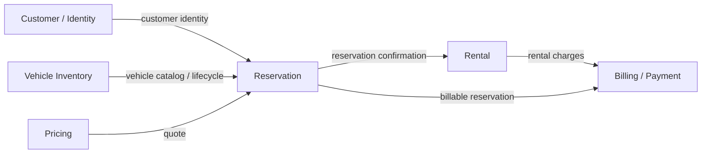

# Domain Model — ACME Car Rental

## Purpose

The repository is a learning laboratory, but the domain must still be usable as a realistic car-rental platform. DDD is used to model business boundaries, not to create folders for their own sake.

## Bounded Context Map



The arrows represent information/contract relationships, not shared object models. A bounded context never imports another context's domain classes.

## 1. Inventory Context

### Responsibility

Own the fleet, vehicle lifecycle and operational state of the fleet.

### Aggregate roots

- `Vehicle`
- `MaintenanceOrder`

`Vehicle` owns the identity and lifecycle of a fleet vehicle. `MaintenanceOrder` owns a maintenance work lifecycle for a vehicle. They are separate aggregates so maintenance can later evolve into its own persistence, events and workflows without turning Vehicle into a large aggregate.

### Vehicle value objects

- `VehicleId`
- `LicensePlate`
- `VehicleSpecifications`
- `VehicleLocation`
- `VehicleDailyRate`
- `OdometerReading`

### Vehicle domain concepts

- `VehicleStatus`: AVAILABLE, IN_MAINTENANCE, DECOMMISSIONED
- `VehicleCondition`: GOOD, NEEDS_INSPECTION, DAMAGED
- `VehicleCategory`
- `Transmission`
- `FuelType`

### Maintenance concepts

- `MaintenanceOrderId`
- `MaintenanceType`: PREVENTIVE, CORRECTIVE, INSPECTION
- `MaintenanceStatus`: OPEN, IN_PROGRESS, COMPLETED, CANCELLED
- `MaintenanceOrder`

### Current behavior

Vehicle already supports:

- registration with default AVAILABLE status;
- decommissioning as a soft-delete lifecycle transition;
- entering/leaving maintenance;
- relocation;
- monotonically increasing odometer readings;
- explicit condition changes;
- immutable base daily rate.

MaintenanceOrder already models:

- opening;
- starting;
- completion;
- cancellation rules;
- rehydration from persistence.

### Useful future concepts

- maintenance work-order persistence;
- scheduled maintenance;
- inspection history;
- damage assessment;
- fleet branch aggregate;
- vehicle availability windows;
- odometer-based maintenance policies.

Availability for a rental period is **not owned by Inventory**. It is a derived concept involving reservations. Inventory owns whether the vehicle exists, is in service, its operational state and whether it can be offered.

### Invariants

- a license plate identifies one vehicle in the fleet;
- a decommissioned vehicle cannot return to AVAILABLE;
- a vehicle in maintenance cannot be offered;
- odometer readings cannot move backwards;
- a vehicle condition is explicit;
- required vehicle specification data must be valid;
- only OPEN maintenance orders can become IN_PROGRESS;
- only IN_PROGRESS maintenance orders can become COMPLETED;
- completed maintenance orders cannot be cancelled.

## 2. Reservation Context

### Responsibility

Own the booking commitment between a customer and a vehicle for a period.

### Aggregate root

`Reservation`

### Value objects

- `ReservationId`
- `CustomerId`
- `VehicleId`
- `RentalPeriod`

### Reservation status

PENDING, CONFIRMED, CANCELLED, REJECTED, COMPLETED.

### Invariants

- end date cannot precede start date;
- a cancelled/completed reservation cannot return to an invalid state;
- reservation state transitions must be explicit;
- overlapping active reservations for the same vehicle must be rejected.

The domain does not own the customer or vehicle aggregate. Their identities cross the context boundary as values.

## 3. Rental Context

### Responsibility

Own the physical rental lifecycle after a reservation is fulfilled.

### Aggregate root

`Rental`

### Value objects

- `RentalId`
- `ReservationId`
- `CustomerId`

### Lifecycle

PENDING -> ACTIVE -> COMPLETED

Cancellation/failure paths should be explicit rather than represented by booleans.

Future concepts:

- VehicleId reference;
- pickup/return branch;
- odometer at pickup and return;
- fuel level;
- inspection;
- damage report;
- late-return policy;
- extensions.

## 4. Pricing Context

Pricing is intentionally modeled as a future bounded context rather than putting pricing rules inside Reservation or Inventory.

Potential concepts:

- `PriceQuote`
- `Money`
- `RatePlan`
- `PricingRule`
- `RentalDuration`
- `OptionalExtra`
- `Promotion`

Inventory may expose vehicle category/specification information that Pricing consumes, but Inventory does not own dynamic pricing rules.

## 5. Billing / Payment Context

The billing service now has the first domain foundation but not the final distributed workflow.

### Aggregate root

`Invoice`

### Supporting concepts

- `InvoiceId`
- `CustomerId`
- `ReservationId`
- `Money`
- `InvoiceLine`
- `InvoiceStatus`
- `PaymentMethod`
- `PaymentStatus`

Future concerns:

- payment authorization;
- payment reference;
- idempotency;
- retries;
- refunds/compensation;
- invoice events;
- asynchronous billing.

## 6. Users Service

`users-service` is a BFF/web adapter, not a duplicate Customer, Reservation or Inventory domain.

It may own:

- authenticated session representation;
- HTML/Qute models;
- browser-oriented orchestration.

Identity ownership remains with Keycloak/external identity infrastructure.

## 7. What is deliberately NOT shared

Never create a common `Car`, `Reservation`, `Rental`, `Customer` or `Money` object under a generic `shared` package merely to avoid mapping.

For example:

```
Inventory.domain.model.Vehicle
Reservation.domain.model.Reservation
Rental.domain.model.Rental
Billing.domain.model.Invoice
```

And at context boundaries:

```
Reservation.application.port.out.InventoryGateway
Reservation.application.query.AvailableVehicle
Users.application.model.ReservationView
```

These are intentionally different representations.

## 8. Domain maturity

### Phase 1 — baseline

- establish bounded contexts;
- establish aggregates and value objects;
- move invariants from resources/repositories into domain;
- establish application use cases and ports;
- introduce TDD at domain/application levels.

### Phase 2 — richer domain

- maintenance workflow;
- pricing;
- billing/payment;
- domain events;
- messaging.

### Phase 3 — distributed behavior

- idempotency;
- retries/timeouts;
- cancellation;
- observability;
- reactive composition;
- concurrency control;
- backpressure;
- consistency/compensation patterns.

The domain should become richer because the use cases require it, not because every DDD tactical pattern must appear in every class.
