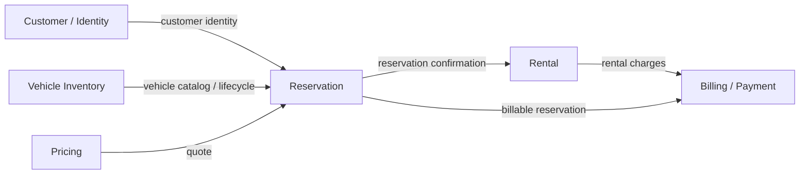

# Domain Model — ACME Car Rental

## Purpose

The repository is a learning laboratory, but the domain must still be usable as a realistic car-rental platform. DDD is used to model business boundaries, not to create folders for their own sake.

## Bounded Context Map



The arrows represent information/contract relationships, not shared object models. A bounded context never imports another context's domain classes.

## 1. Inventory Context

### Responsibility

Own the fleet and the lifecycle of vehicles.

### Aggregate root

`Vehicle`

### Value objects

- `VehicleId`
- `LicensePlate`
- `VehicleSpecifications`
- `VehicleLocation`

### Enumerations / domain concepts

- `VehicleStatus`: AVAILABLE, IN_MAINTENANCE, DECOMMISSIONED
- `VehicleCategory`
- `Transmission`
- `FuelType`

### Useful future concepts

- Maintenance work orders
- Fleet location / branch
- Vehicle odometer
- Vehicle condition
- vehicle inspection history

Availability for a rental period is **not owned by Inventory**. It is a derived concept involving reservations. Inventory owns whether the vehicle exists, is in service, is available to be offered, or is decommissioned.

### Invariants

- a license plate identifies one vehicle in the fleet;
- a decommissioned vehicle cannot return to AVAILABLE;
- a vehicle in maintenance cannot be offered as AVAILABLE;
- required vehicle specification data must be valid.

## 2. Reservation Context

### Responsibility

Own the booking commitment between a customer and a vehicle for a period.

### Aggregate root

`Reservation`

### Value objects

- `ReservationId`
- `CustomerId`
- `VehicleId`
- `RentalPeriod`

### Reservation status

PENDING, CONFIRMED, CANCELLED, REJECTED, COMPLETED.

### Invariants

- end date cannot precede start date;
- a cancelled/rejected reservation cannot be confirmed again;
- reservation state transitions must be explicit;
- overlapping reservations for the same vehicle must be rejected by the application/domain policy.

The domain does not own the customer or vehicle aggregate. Their identities cross the context boundary as values.

## 3. Rental Context

### Responsibility

Own the physical rental lifecycle after a reservation is fulfilled.

### Aggregate root

`Rental`

### Value objects

- `RentalId`
- `ReservationId`
- `CustomerId`
- `VehicleId`
- `RentalPeriod`

### Lifecycle

PENDING -> ACTIVE -> COMPLETED

and failure/cancellation paths should be explicit rather than represented by boolean flags.

Future concepts:

- pickup/return branch;
- odometer;
- fuel level;
- inspection;
- damage report;
- late-return policy.

## 4. Pricing Context

Pricing is intentionally modeled as a future bounded context rather than putting rates into Reservation or Inventory.

Potential concepts:

- `PriceQuote`
- `Money`
- `RatePlan`
- `PricingRule`
- `RentalDuration`
- `OptionalExtra`

Inventory may expose category/specification information that Pricing consumes, but Inventory does not own pricing rules.

## 5. Billing / Payment Context

The current `billing-service` is a placeholder, so the initial domain structure should express ownership without inventing a complete payment workflow.

Potential aggregate:

`Invoice`

Supporting concepts:

- `InvoiceId`
- `CustomerId`
- `ReservationId`
- `Money`
- `InvoiceLine`
- `BillingStatus`
- `PaymentMethod`
- `PaymentStatus`
- `PaymentReference`

Future concerns:

- payment authorization;
- idempotency;
- retries;
- invoice state;
- compensation/refund;
- asynchronous events.

## 6. Users Service

`users-service` is a BFF/web adapter, not a duplicate Customer domain.

It may own presentation concerns:

- authenticated session representation;
- HTML/Qute models;
- orchestration of browser-facing calls.

Identity ownership remains with Keycloak / the external identity provider. Business customer concepts should only be introduced if real customer behavior is added.

## 7. What is deliberately NOT shared

Never create a common `Car`, `Reservation`, `Rental`, `Customer`, or `Money` object under a generic `shared` package merely to avoid mapping.

For example:

```
Inventory.domain.Vehicle
Reservation.application.port.out.VehicleAvailability
Rental.application.port.out.ReservationSnapshot
Billing.application.port.out.ReservationBillingData
```

These are intentionally different representations.

## 8. Domain maturity

The target is evolutionary.

Phase 1:
- establish aggregates and value objects;
- move invariants from resources/repositories into domain;
- establish use cases and ports;
- introduce TDD at the domain/application levels.

Phase 2:
- introduce richer lifecycle rules;
- domain events;
- messaging;
- pricing and billing behaviors.

Phase 3:
- resilience/idempotency/observability;
- reactive pipelines and backpressure;
- distributed consistency patterns.

The domain should become richer because the use cases require it, not because every DDD tactical pattern must appear in every class.
